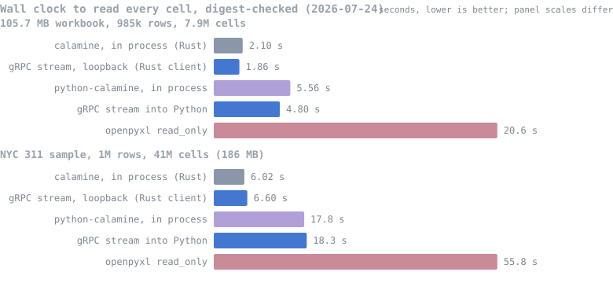
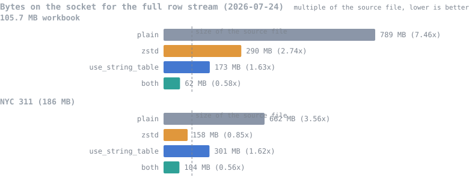
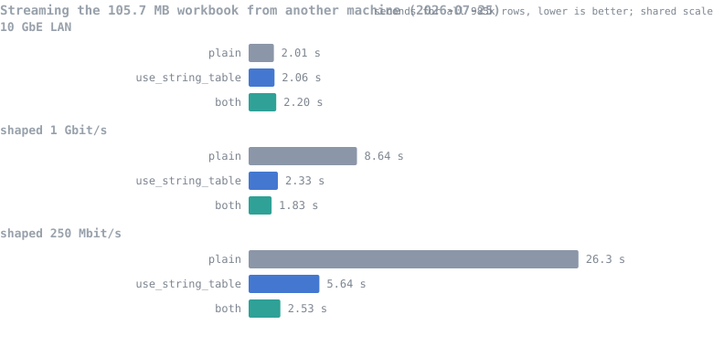
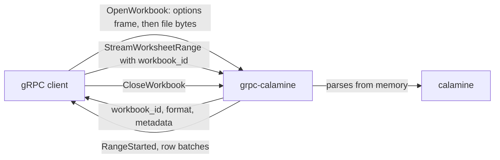

# grpc-calamine

A gRPC server around the Rust [calamine](https://github.com/tafia/calamine)
crate. Upload a workbook once, then stream its cells, formulas, VBA modules,
and embedded pictures from any language with a gRPC client. Rows go out
while the sheet is still being parsed, uploaded bytes stay in memory, and
nothing is written to disk.

Formats: `.xls`/`.xla`, `.xlsx`/`.xlsm`/`.xlam`, `.xlsb`, `.ods`.

## Speed

Two workbooks, measured 2026-07-24 on a Ryzen 9 9950X3D: a 105.7 MB
`.xlsx` with 985,351 rows (7.9 million cells), and the NYC 311 1M-row
sample (41 million cells) that calamine's own README benchmarks against,
converted from the published CSV with LibreOffice into the same 186 MB
file upstream reports. Full captures and methodology live in
[bench/RESULTS.md](bench/RESULTS.md) and [bench/](bench).



The first streamed row arrives in a few milliseconds; a batch API answers
after the whole parse. End to end, the stream lands within 10% of the
in-process library call, and on the smaller file it wins outright, because
the server parses while the client decodes on other cores. What the socket
costs is CPU (roughly 1.6x the single-threaded work) and bytes: protobuf
re-expands the strings the workbook stores once. Both fixes are built in,
and measured rather than assumed:



`use_string_table` is dictionary encoding: each distinct string crosses
the wire once and cells carry u32 ids. It is also the cheapest mode on
CPU, since neither side copies string bodies per cell; zstd buys its bytes
with extra CPU instead. Which one wins on bytes alone depends on the data,
as the two files above show, and the combination is the smallest in every
run, at just over half the size of the source `.xlsx`. Every mode feeds
the same digest check, so none of them can win by dropping data.

The wire sizes stop being an abstraction once a real network sits between
the machines. Same 105.7 MB workbook, server on a second machine, the
link shaped with `tc`:



On a saturated link the transfer is bytes divided by bandwidth, so the
smaller stream is the faster stream: at 250 Mbit/s the dictionary with
zstd is 10x faster than the plain stream, and at 1 Gbit/s it beats plain
mode running on 10 GbE, because 62 MB stays under the parse time even at
gigabit rates.

Two Python notes, because they would be easy to overclaim: dictionary mode
does not change Python wall clock on loopback (the interpreter's per-cell
loop is the bottleneck; the win there is the wire), and openpyxl's rows
above cover a slightly different grid, since it trusts the workbook's
declared dimension where calamine trims to the real extent.

Your workbook and your hardware will move all of this. The bench reruns
everything with one command.

## How it works

- **Nothing touches disk.** Uploaded bytes live in memory (`Arc<[u8]>`) and
  calamine parses them through its `open_workbook_*_from_rs` readers.
- **Rows stream during the parse.** XLSX and XLSB use calamine's incremental
  cell readers. XLS and ODS only support whole-range parsing, so those parse
  first and then stream. The wire contract is identical either way, and the
  streamed grid matches calamine's own `worksheet_range`: trailing blank
  rows trimmed, interior gaps sent as rows with no cells, `header_row`
  honored the same on every format. The test suite asserts that parity
  against calamine for every sheet of every fixture, including synthetic
  workbooks whose declared `<dimension>` lies.
- **Reads don't block each other.** Each read builds its own calamine reader
  over the shared bytes, so many clients can stream one workbook at once.
  Parsing runs on tokio's blocking pool behind a bounded channel, so a slow
  client slows its own parse instead of filling server memory.
- **The protobuf model mirrors calamine's types one to one** (`Data`,
  `Range`, `Cell`, `ExcelDateTime`, `CellErrorType`, ...). Conversions in
  `src/convert.rs` are total; nothing is guessed or flattened.

## Run

```bash
cargo run --release
# grpc-calamine listening on 0.0.0.0:50062
```

Use `--release`; a debug build parses more than an order of magnitude
slower.

| Variable                         | Default        | Meaning                                     |
|----------------------------------|----------------|---------------------------------------------|
| `GRPC_CALAMINE_ADDR`             | `0.0.0.0:50062`| Listen address                              |
| `GRPC_CALAMINE_WORKERS`          | CPU count      | tokio worker threads                        |
| `GRPC_CALAMINE_BLOCKING_THREADS` | `512`          | max threads for calamine parsing tasks      |
| `GRPC_CALAMINE_WINDOW_BYTES`     | `52428800`     | HTTP/2 initial stream and connection window |
| `GRPC_CALAMINE_MAX_CONCURRENT_STREAMS` | `128`    | streaming reads admitted at once            |
| `GRPC_CALAMINE_MAX_CONCURRENT_UPLOADS` | `16`     | `OpenWorkbook` uploads admitted at once     |
| `GRPC_CALAMINE_MAX_OPEN_WORKBOOKS` | `256`        | workbooks open at once                      |
| `GRPC_CALAMINE_MAX_STORE_BYTES`  | `2147483648`   | bytes the open workbooks hold together (2 GiB) |
| `GRPC_CALAMINE_HANDLE_TTL_SECS`  | `300`          | idle seconds before a workbook is closed; `0` never |
| `GRPC_CALAMINE_MAX_PICTURE_BYTES` | `67108864`    | largest embedded picture, inflated (64 MiB) |
| `GRPC_CALAMINE_MAX_PICTURE_TOTAL_BYTES` | `268435456` | one workbook's pictures together, inflated (256 MiB) |
| `GRPC_CALAMINE_MAX_SHARED_STRINGS_BYTES` | `1073741824` | largest shared-string table, inflated (1 GiB) |
| `GRPC_CALAMINE_MAX_DENSE_CELLS`  | `33554432`     | cells one formula, XLS or ODS stream may densify |

The window default is 50 MiB because window size over round-trip time caps
upload throughput; hyper's 1 MiB default holds a 10 ms link near 100 MB/s.
It governs the upload only. A client that wants a wide window for the row
stream sets its own.

The server accepts gzip- and zstd-compressed requests and compresses
responses for any client that negotiates it. No configuration needed on
either side beyond the client asking.

Every workbook a client opens stays in memory until it is closed, and
nothing guarantees a client gets to close it: a killed process, a network
partition or a `CloseWorkbook` that times out each leave one behind. So the
store is bounded three ways. A workbook nobody has used for
`GRPC_CALAMINE_HANDLE_TTL_SECS` is closed for its client, and any later call
on its id gets `NOT_FOUND`; one that a read is still streaming is in use, so
a read that takes longer than the TTL keeps its handle. Past
`GRPC_CALAMINE_MAX_OPEN_WORKBOOKS` workbooks, or past
`GRPC_CALAMINE_MAX_STORE_BYTES` of uploaded bytes held between them, the
next `OpenWorkbook` is refused with `RESOURCE_EXHAUSTED`, during the upload
rather than after it, once idle workbooks have been closed to make room.
Uploads themselves are admitted against `GRPC_CALAMINE_MAX_CONCURRENT_UPLOADS`
slots, since each buffers its workbook in memory until it is parsed, and an
upload that sends nothing for 30 s is abandoned with `DEADLINE_EXCEEDED` so
it cannot hold a slot forever. The server logs each time it closes idle
workbooks, with how many remain open and what they hold.

Some parts of a workbook are read whole while calamine opens it, before any
sheet is asked for: every embedded picture (the server is built with
calamine's `picture` feature) and the shared-string table. Deflate reaches
about 1,000:1 and the zip format's recorded sizes come from the uploader,
so a 5 MB upload could claim 5 GB there, and an allocation that size aborts
the process rather than failing the request. So the server inflates those
parts first, into nothing, counting, and refuses the workbook with
`RESOURCE_EXHAUSTED` past `GRPC_CALAMINE_MAX_PICTURE_BYTES` for one picture,
`GRPC_CALAMINE_MAX_PICTURE_TOTAL_BYTES` for all of them, or
`GRPC_CALAMINE_MAX_SHARED_STRINGS_BYTES` for the table. That costs one extra
inflation of those parts per open. The pictures that pass are charged
against `GRPC_CALAMINE_MAX_STORE_BYTES` along with the upload, since the
workbook's parked reader keeps them.

Hard limits (compile-time, `src/service.rs`): 512 MiB max workbook upload,
32 MiB max gRPC frame, 64-event stream backpressure channel, 8 MiB per row
batch, 65,536 rows per batch, 30 s upload stall, 30 s consumer stall.

That last one is what keeps a client from taking the server down by opening
streams and never reading them: a parse waits on a slow consumer, but not
forever, and a stream abandoned that way ends with `DEADLINE_EXCEEDED`
instead of pinning a parser thread permanently. The concurrency cap above
bounds the same failure from the other side.

Nothing read out of an uploaded file is trusted as a size. A declared
`<dimension>` only reserves capacity, clamped to Excel's own 16,384-column
limit, and the row's real width comes from the cells that arrive; calamine
itself only warns past that limit rather than clamping, so `A1:ZZZZZZ1` in a
2 KB upload parses to column 321,272,405. A declaration whose end precedes
its start reports zero cells rather than underflowing. A panic anywhere in
the parse is delivered as a gRPC `INTERNAL` status, never as a stream that
ends successfully having sent nothing.

**Some streams send a dense range, and those are budgeted.** The value
stream of an xlsx or xlsb sheet goes cell by cell and never builds one. A
formula stream, and any XLS or ODS stream, sends every row of its range
from column A, and a range is as large as the two cells furthest apart make
it: two formulas at opposite corners of a sheet are about 17 billion cells.
calamine's own `worksheet_formula` densifies that extent before the first
row, about 412 GB of `String`s, so for xlsx and xlsb the server collects the
formula cells itself and builds one row at a time. Either way a range of
more than `GRPC_CALAMINE_MAX_DENSE_CELLS` cells, counted from column A, is
refused with `RESOURCE_EXHAUSTED` before its first event. The default covers
a whole .xls sheet (65,536 x 256) twice over.

One cost stays outside that budget: calamine parses an XLS or ODS workbook
into dense ranges while opening it, before the server sees a sheet. ODS is
capped there by calamine itself at 100 million cells per sheet, past which
`OpenWorkbook` is refused; XLS ranges are allocated fallibly by the fork's
`Range::from_sparse`, but one that merely fits is still allocated in full.

## API

Handle-based: upload once, then run any number of concurrent reads against
the returned `workbook_id`.


```mermaid
flowchart LR
    client[gRPC client] -->|OpenWorkbook: options frame, then file bytes| server[grpc-calamine]
    server -->|parses from memory| calamine[calamine]
    server -->|workbook_id, format, metadata| client
    client -->|StreamWorksheetRange with workbook_id| server
    server -->|RangeStarted, row batches| client
    client -->|CloseWorkbook| server
```

`OpenWorkbook` is a client-streaming upload: one options frame, then file
bytes. It returns `workbook_id`, the detected format, and full metadata.

`StreamWorksheetRange` sends a `RangeStarted` header, then dense rows
anchored at column A, so a value's index is its absolute column. Rows
arrive batched (`WorksheetRowBatch`, up to 256 rows, 5 ms linger); set
`max_rows_per_message = 1` for one row per message. Setting
`use_string_table = true` switches to dictionary encoding: `string_table`
events define each distinct string once, cells carry `shared_string_id`,
and every id is defined before the first row that references it. The
dictionary is XLSX/XLSB only; other formats accept the flag unchanged.

Close handles when you are done with them. One left open is closed for you
once it has been idle for the TTL (five minutes by default), but until then
it counts against the store's limits.

`StreamWorksheetFormula` has the same shape with formula strings instead of
values. `StreamVbaProject` sends project info, then one event per module
(raw MBCS bytes; decoding is the client's choice, matching calamine).
`GetPictures` sends one event per embedded image. A picture or module too
large for one 32 MiB message is reported with a non-terminal `StreamError`
and skipped, and the stream goes on. `GetMetadata`,
`GetDefinedNames`, and `CloseWorkbook` are the remaining unary calls.
`GetMetadata` also returns the `UiInfo` frontend advertisement shared by
every ai-pipestream service, so embedding hosts can discover and link this
service's web UI from the contract alone.

Terminal failures use gRPC status codes (`NOT_FOUND`, `INVALID_ARGUMENT`,
`RESOURCE_EXHAUSTED`). Recoverable per-item failures arrive as in-band
`StreamError` events with a typed `CalamineError`, so one bad sheet doesn't
kill the stream.

### Client sketch (Rust)

```rust
// 1. Upload: first frame = options, then file bytes in <= 1 MiB chunks.
let opened = client.open_workbook(frames).await?.into_inner();

// 2. Stream a sheet by name or index.
let mut rows = client
    .stream_worksheet_range(StreamWorksheetRangeRequest {
        workbook_id: opened.workbook_id.clone(),
        sheet: Some(SheetSelector {
            selector: Some(sheet_selector::Selector::SheetName("Sheet1".into())),
        }),
        max_rows_per_message: 0, // 0 = server default (batched)
        use_string_table: false,
    })
    .await?
    .into_inner();
while let Some(event) = rows.message().await? {
    // RangeStarted | WorksheetRowBatch | WorksheetRow | StringTableChunk | StreamError
}

// 3. Release the handle.
client.close_workbook(CloseWorkbookRequest {
    workbook_id: opened.workbook_id,
}).await?;
```

## Building from source

Rust stable, the [buf](https://buf.build/docs/installation) CLI, and the
codegen plugins at the versions that produced `src/gen`
(`cargo install --locked protoc-gen-prost@0.5.0 protoc-gen-tonic@0.5.0`).

```bash
buf lint && buf generate   # after editing anything under proto/
buf build -o src/gen/calamine/v1/calamine.v1.binpb   # the reflection descriptor
cargo build
cargo test                 # unit + end-to-end streaming tests
```

CI regenerates both and fails if `src/gen` differs from what is checked in,
so the code and the descriptor that reflection serves cannot drift from the
contract.

### Building against patched calamine

The API used is calamine 0.36, but `Cargo.toml` carries a
`[patch.crates-io]` pinned to a commit of [`ai-pipestream/calamine`][fork]
`pipestream-main`, which is upstream `master` with three fix branches
merged:

| upstream defect | issue | fix |
|---|---|---|
| reversed `<dimension ref>` underflows the extent | [#692][i692] | [#695][p695] |
| `from_sparse` densifies without a bound | [#693][i693] | [#697][p697] |
| cell-ref column arithmetic overflows `u32` | [#694][i694] | [#696][p696] |

`bench/` carries the same patch, because it is a separate crate and does not
inherit one. Without it the harness would link crates.io calamine while the
server links the fork, quietly falsifying its own claim to measure the same
build. Both lock files pin the same commit.

Nothing here depends on an API those fixes introduce, so remove both
`[patch]` sections once the fixes are released. Until then, building against
stock crates.io calamine still works and still passes the suite; you just
lose the three guarantees above, of which the `from_sparse` bound is the one
that can take the process down: calamine builds every XLS sheet with it when
the workbook is opened, as the dense-range note under [Run](#run) explains.

[fork]: https://github.com/ai-pipestream/calamine
[i692]: https://github.com/tafia/calamine/issues/692
[i693]: https://github.com/tafia/calamine/issues/693
[i694]: https://github.com/tafia/calamine/issues/694
[p695]: https://github.com/tafia/calamine/pull/695
[p696]: https://github.com/tafia/calamine/pull/696
[p697]: https://github.com/tafia/calamine/pull/697

```
proto/calamine/v1/     protobuf contract (source of truth)
src/
  convert.rs           calamine <-> protobuf conversions
  store.rs             in-memory workbook store
  service.rs           the CalamineService implementation
  gen/                 generated by `buf generate`, never edited by hand
tests/streaming.rs     end-to-end tests against real workbook fixtures
bench/                 the measurement harness behind the numbers above
demos/                 Java, Python, and Node clients, plus a web viewer
```

## Tests

`cargo test` starts a real tonic server on an ephemeral port and streams
real workbook files. Every streamed cell is compared against calamine's own
`worksheet_range` output, across every sheet of every fixture, including
synthetic workbooks whose declared `<dimension>` lies (inflated,
under-declared, shifted). Dictionary mode, compression, batching modes,
concurrency, in-band errors, VBA, formulas, and datetime fidelity all have
dedicated tests.

## Demos

Self-contained example clients in Java, Python, and Node live under
[`demos/`](demos), including a web viewer that renders sheets in the browser
as the server parses them. Each one's README ends with a from-scratch
tutorial for that language: the dependency, the stub generation, and a short
program that uploads a workbook and prints its rows. See
[demos/README.md](demos/README.md).

## License

Apache-2.0. See [LICENSE](LICENSE).
